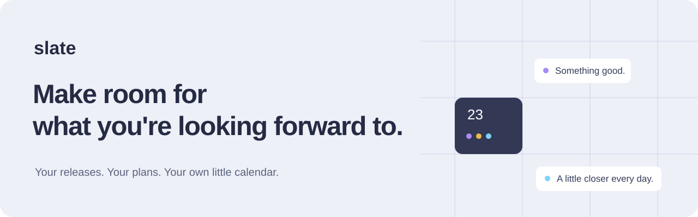
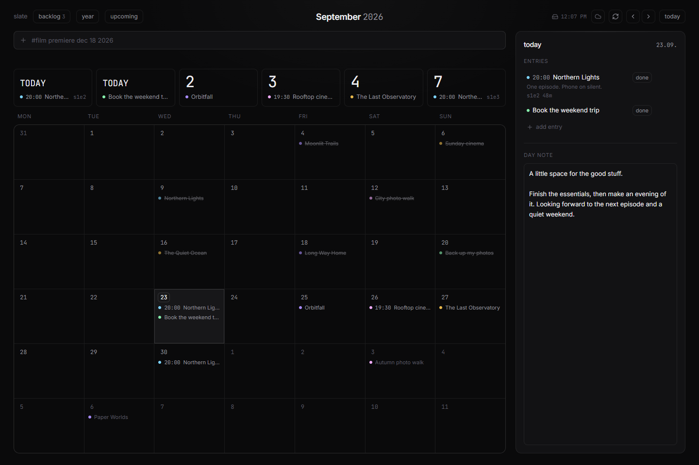
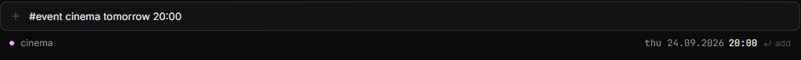
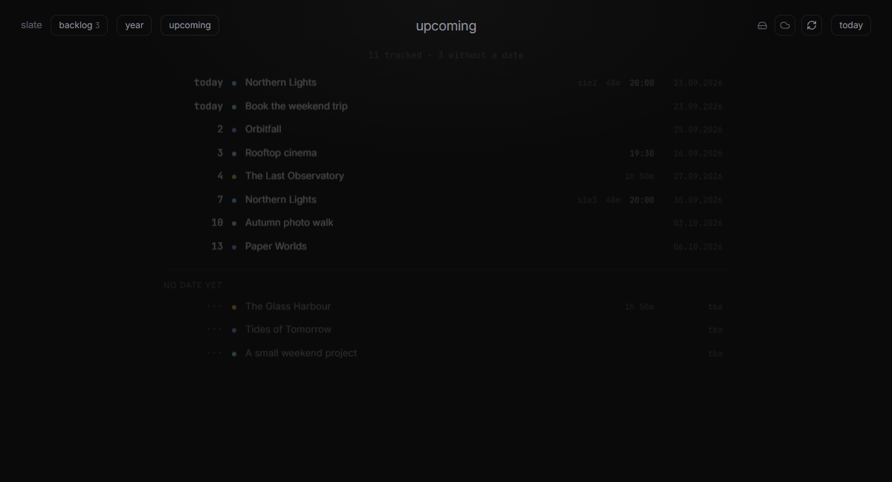

<div align="center">



**A personal Windows calendar for releases, plans, and the memories you make along the way.**

[Download for Windows](https://github.com/SPARTANAC95/slate/releases/latest) · [Visit the website](https://spartanac95.github.io/slate/) · [User guide](docs/USER-GUIDE.md) · [Build from source](docs/DEVELOPMENT.md)

[](https://github.com/SPARTANAC95/slate/actions/workflows/checks.yml)


</div>



Slate brings the game you are waiting for, your next film night, weekly episodes, and everyday plans into one quiet calendar. Add an idea in a sentence, give it a day when you are ready, and keep a small record of what you enjoyed.

Your calendar lives on your computer. Core planning works without an account or API keys. Online metadata and Google Calendar are optional.

## What you can do

| Before it happens | When you make time | Afterward |
| --- | --- | --- |
| Track games, films, series, events, tasks, and notes | See your month or a chronological upcoming list | Mark an entry done |
| Search release metadata and cover art | Move an idea from the backlog onto a date | Give it a rating and a short verdict |
| Follow release changes and their history | Get morning and timed Windows reminders | Look back through the year view |
| Keep your own date pinned | Let **Pick for me** help choose from your backlog | Write a note for the day |

### One sentence is enough

```text
#event cinema tomorrow 20:00
#task book tickets in 3 days
#film The Glass Harbour
anniversary 4.7. every year
```

Slate previews what it understood before you press **Enter**. An entry without a date goes into your backlog. English and Bosnian/Serbian/Croatian date words such as `tomorrow`, `sutra`, and `petak` are supported.



### See what is next

Countdowns keep the nearest plans visible. The upcoming view puts all unfinished entries in order, including a separate section for ideas without a date.



<sub>Real screenshots of Slate's shared UI in an isolated browser session. Titles, plans, and dates are fictional examples. The backup endpoint was simulated for the screenshots; no personal calendar data is shown.</sub>

## Get started in a minute

1. Download the latest **Windows x64 setup file** from [Releases](https://github.com/SPARTANAC95/slate/releases/latest) and install it on Windows 10/11, x64.
2. Open **Slate** from the Start menu. Type `#event cinema tomorrow 20:00` and press **Enter**.
3. Click any day to edit entries or write a daily note. Press **Ctrl+K** for search, preferences, import, and export.

The installer has no Windows publisher certificate, so Windows may show an unknown-publisher prompt. Check that your file came from this repository's Releases page; each release includes a SHA-256 checksum.

**Stay up to date:** Slate 0.1.1 and newer check for new releases automatically. Open **Preferences → App updates** to check manually, read release notes, or choose **Install and restart**. Slate verifies the download and backs up your calendar before installing. If you have 0.1.0, install the latest setup file once to enable this. [How updates and releases work →](docs/RELEASING.md)

Closing the window keeps Slate in the system tray. Use **Quit** in the tray menu to exit completely. Reminders and Google sync require Slate to remain running.

## Your calendar stays yours

- **Autosave:** entries save as you work; notes and verdicts save after a short pause and on blur.
- **Disk backups:** the app keeps a local JSON mirror and rotating history. Export a separate copy before moving computers or making large changes.
- **Import with a preview:** Slate shows what will be added or updated. Matching IDs merge using the newer timestamp.
- **Recover deleted entries:** restore through the command palette during the normal 30-day recovery window.
- **Optional connections:** TMDB for films/series, IGDB or Steam for games, and one-way **Slate → Google Calendar** sync on Windows.

Metadata lookups and artwork contact their providers. Enabling Google sync sends dated entry titles, notes, links, and related event details to the calendar you choose. [Read the data and backup guide](docs/USER-GUIDE.md#data-and-backups) and [Google setup guide](docs/GOOGLE-CALENDAR.md).

## A few shortcuts worth knowing

| Key | Action |
| --- | --- |
| **Ctrl+K** / **/** | Open the command palette |
| **N** | Focus quick add |
| **T** | Go to today |
| **B** | Toggle backlog |
| **U** / **Y** | Upcoming / year view |
| **Arrow keys** | Move between days and weeks |
| **Shift+← / Shift+→** | Previous / next month |
| **?** | Show all shortcuts |

Shortcuts work when you are not typing into a field. [Full usage guide](docs/USER-GUIDE.md).

## For developers

React 18 + TypeScript + Vite, with Dexie/IndexedDB for local data and Tauri 2 + Rust for the Windows app. The browser development mode uses a loopback Express server for metadata and disk backups.

```sh
git clone https://github.com/SPARTANAC95/slate.git
cd slate
npm ci
npm run dev
```

Open `http://localhost:5173`. Node.js 22.12+ is required. Optional metadata keys are documented in `.env.example`; manual planning works without them.

```sh
npm test              # JavaScript and TypeScript tests
npm run build         # TypeScript check + production web build
npm run dev:app       # Native development; Windows prerequisites required
npm run build:app     # Windows executable + NSIS installer
```

Run `cargo test --locked --lib` inside `src-tauri` for the native tests. [Developer setup, architecture, and packaging](docs/DEVELOPMENT.md) · [Contributing](CONTRIBUTING.md).

**Current scope:** Windows x64 desktop. Browser mode is for local development; the GitHub Pages website is a product guide, not an online calendar. macOS/Linux packages and two-way calendar sync are not provided.

## Credits and source use

Created by [SPARTANAC95](https://github.com/SPARTANAC95). This product uses the TMDB API but is not endorsed or certified by TMDB. Optional game metadata comes from IGDB and the Steam store. Provider artwork remains the property of its respective owners.

No open-source license has been granted for Slate's source code. Third-party dependencies retain their own licenses. For bugs and ideas, [open an issue](https://github.com/SPARTANAC95/slate/issues).
